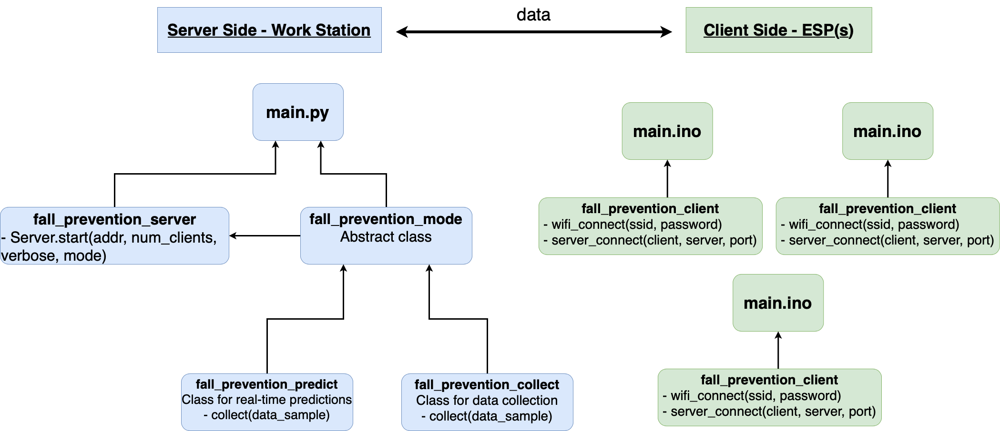

  

<h1 align="center">Fall Prevention</h1>

## Description
- A Project with Rambam Health Care Campus, that aim to prevent patients (with temporary neurological disability) from falling out of bed in hospitals.
- Out data is collected by a device we created with ESP32 micro-controller, using Force-sensors and wieght sensors.
- ESP32 communications (server-client) and data collection written in C/C++.
- Machine Learning, Deep Learning predictions implemented with Python (Jupyter Notebook) using SKLearn, Keras (Tensorflow) and more.
- Models: Recurrent Neural Network (RNN), Convolutional Neural Network (CNN), Random Forest

Hardware Design           |  System Design 
:-------------------------:|:-------------------------:
  |  

Sensors Layout          |  Collecting the Data
:-------------------------:|:-------------------------:
  |  

Software Design      |  Nurses Station Website
:-------------------------:|:-------------------------:
 |  

Convolutional Neural Network    | Recurrent Neural Network
:-------------------------:|:-------------------------:
 |  
